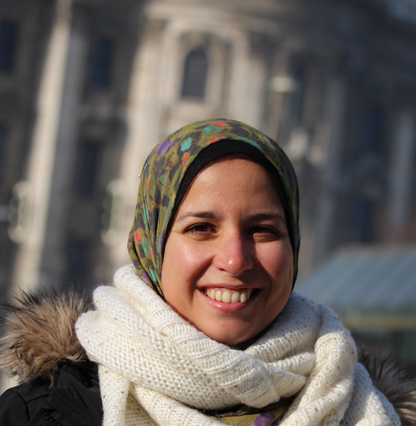
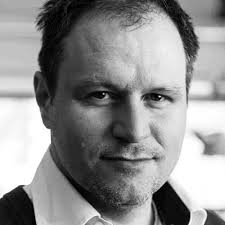
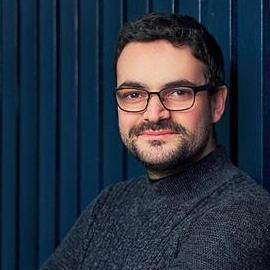
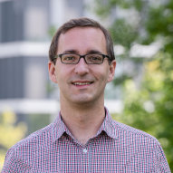

---
sidebar:
  - title: "Important Dates:"
    image_alt: "in the moment emotions."
    text: "Papers Deadline: 25-Feb-2020"
  - extra: ""
    text: "Papers Decisions: 28-Feb-2020"
  - extra: ""
    text: "Workshop: Saturday, 25-April-2020"
  - extra: ""
    text: " "
  - extra: ""
    text: "Location: TBA"
  - extra: ""
    text: "Contact: [aea@cwi.nl](mailto:aea@cwi.nl)"

layout: single
title: Organizers & Program Committee
---

<!--  -->
 

{:height="80px" width="80px"} &nbsp; **Abdallah El Ali**{:style="color: black"} - CWI, Amsterdam

Abdallah El Ali is a tenure-track researcher at the [Distributed & Interactive Systems](https://www.dis.cwi.nl/) group at [Centrum Wiskunde & Informatica (CWI)](https://www.cwi.nl/) in the Netherlands. His research focuses on focuses on human activity sensing and recognition, mobile and wearable interaction techniques, and multimodal interaction, unified by the goal of further understanding human behavior and emotion. He combines advances in HCI and machine learning to enable pervasive affect sensing in and beyond mobile interactions. Website: [https://abdoelali.com/](https://abdoelali.com/){:target="\_blank"}

---

{:height="80px" width="80px"} &nbsp; **Monica Perusquía-Hernández**{:style="color: black"} - NTT , Japan

Monica Perusquía-Hernández is a Research Associate at NTT Communication Science Laboratories, Japan. Her research interests include affective computing, bio-signal processing, augmented human technology, and artificial intelligence. In particular, she is interested in sensing techniques such as Computer Vision, EMG and Skin Conductance for congruence estimation between facial expressions and emotions when assessing user experience. Website: [http://monicaperusquia.com/](http://monicaperusquia.com/){:target="\_blank"}

---

{:height="80px" width="80px"} &nbsp;&nbsp; **Pete Denman**{:style="color: black"} - Intel, USA

Pete Denman is a Senior Designer developing exploratory prototypes in "Labs" at Intel Corp. Focus on capturing emotion in daily life. He guides ideas through the design process, working with developers, engineers, and ethnographic researchers to create future technologies. Known best for being the lead designer at Intel for famed physicist Stephen Hawking's speech software, Denman could relate to Hawking's circumstances more than most due to his disability. Pete has a passion for connecting the areas of disabilities and learning/education with technology. Denman's current work focuses on affective computing and robots.

---

{:height="80px" width="80px"} &nbsp;&nbsp; **Yomna Abdelrahman**{:style="color: black"} - BU Munich, Germany

Yomna Abdelrahman is a postdoctoral researcher at the Bundeswehr University Munich in Germany. Her research focuses on Thermal Imaging operating in the far-infrared spectrum, novel interactive systems, engagement sensing and adaptive bio-sensor assistive systems. Recently, her research focus shifted to affective computing using thermal cameras as unobtrusive sensor.

---

{:height="80px" width="80px"} &nbsp;&nbsp; **Mariam Hassib**{:style="color: black"} - BU Munich, Germany

Mariam Hassib is a postdoctoral researcher at the Bundeswehr University Munich in Germany. Her research interests are Brain Computer Interfaces (BCI), and Physiological Computing. She is working on building systems which provide feedback and adapt to the cognitive and affective states of users. She leverages the current ubiquity of BCI devices and wearable physiological sensors to create new tools that support cognitive-awareness outside the lab environment.

---

{:height="80px" width="80px"} &nbsp;&nbsp; **Alexander Meschtscherjakov**{:style="color: black"} - Uni Salzburg, Austria

Alexander Meschtscherjakov is Associate Professor at the Center for Human-Computer Interaction of Salzburg University. He is focusing on persuasive interaction technologies, automotive user interfaces, contextual user experience and challenges of automation for HCI with a special focus on affective computing. He has co-organised conferences such as Persuasive '15 and more than 25 workshops (e.g., CHI 2019).

---

{:height="80px" width="80px"} &nbsp;&nbsp; **Denzil Ferreira**{:style="color: black"} - Uni Oulu, Finland

Denzil Ferreira is an Associate Professor in Mobile Computing. He acts as Deputy Director at the [Center for Ubiquitous Computing](http://ubicomp.oulu.fi), and is the lead PI at [UBICOMP-CIA]( https://www.ubicomp-cia.com). His research interests are on technology-driven human behavior sensing and modeling, juxtaposing methods from large-scale data analysis, sensor instrumentation, applied machine learning, mobile and ubiquitous computing to understand and study a variety of human behavioral and social phenomena in naturalistic settings.

---

{:height="80px" width="80px"} &nbsp;&nbsp; **Niels Henze**{:style="color: black"} - Uni Regensburg, Germany

Niels Henze is professor for Media Informatics at the University of Regensburg. His research interests are mobile human-computer interaction and pervasive computing. Particularly, he is interested in large-scale studies using mobile application stores as a research tool, interlinking physical objects and digital information, and multimodal interfaces. His recent work focuses on identifying, manipulating and evaluating how our sense of presence is affected in virtual reality environments.
