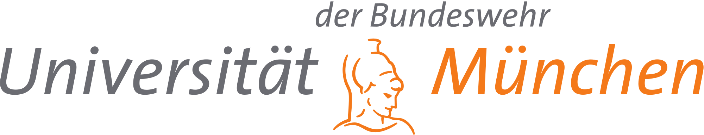

<!-- actions:
    - label: "Submit [EasyChair]"
      url: "https://easychair.org/conferences/?conf=meec2020"
       -->
The second half-day virtual workshop on Momentary Emotion Elicitation and Capture (MEEC) is to be held on Sunday, May 9th, 2021 during the [ACM CHI 2021 Conference](https://chi2021.acm.org/){:target="\_blank"} virtually.
  

## About

Recognizing human emotions and responding appropriately has the potential to radically change the way we interact with technology. However, to train machines to sensibly detect and recognize human emotions, we need valid emotion ground truths. We face a fundamental challenge concerning temporal resolution in emotion elicitation and measurement: even though emotions, whether microexpressions or bodily changes, are in continuous flux and can be measured, self-reports do not have the same temporal resolution. Several factors contribute to this temporal resolution mismatch, including different awareness levels across individuals; non-linearity in time perception; and how emotions themselves alter time perception.

In this 2nd virtual workshop, we address this challenge of Momentary Emotion Elicitation and Capture (MEEC) from individuals, continuously and in real-time, without adversely affecting user experience. The goals for this second edition of the virtual CHI 2021 workshop are:

1. Have participant talks and an inspirational keynote presentation
2. Ideate elicitation, sensing, and annotation techniques
3. Create mappings of when to apply an elicitation method

## How to Participate

We invite position papers, posters, and demos (2-9 pages, including references) that describe/showcase emotion elicitation and/or capture methods. Submissions should be single blind (i.e., not anonymized). Each submission will be peer-reviewed by 2 peers, and selected on their potential to spark discussion. Submissions should be prepared according to the `ACM Master Article template` (single column) (see [CHI Publication Formats page](https://chi2021.acm.org/for-authors/chi-publication-formats){:target="\_blank"}) and submitted in PDF through [Easychair](https://easychair.org/conferences/?conf=meec2021){:target="\_blank"}. Accepted submissions will be made available on the workshop website. At least one author must register for the workshop ($30) and one day of the conference ($100 for early ACM/SIGCHI member). See [CHI 2021 blog post on registration rates](https://chi2021.acm.org/information/4702.html) for details.

[Submit [EasyChair]](https://easychair.org/conferences/?conf=meec2021){: .btn .btn--warning}{:target="\_blank"}

## Accessibility

Message from CHI 2021 WS chairs:

Mar 2 (update) - Dear potential delegates, please note the workshop organisers are in discussion with the overall workshops chairs (who are discussing with the Accessibility Chairs and the General Chairs) for ACM CHI 2021. Please note the current set of technologies listed should not be a barrier to your participation.

Please apply to attend and we will discuss your accessibility needs with you. As chairs for this particular workshop we are committed to being inclusive so we will work with our delegates to ensure participation for all as CHI 2021 is for all. This might mean we drop our plans to use any particular technology if we cannot find a suitable way to make the experience for delegates inclusive.

## Organization

 &nbsp;
 &nbsp;
 &nbsp;
 &nbsp;  

List of organizers [here](committee).

## 1st MEEC Workshop at CHI 2020

First MEEC workshop at CHI 2020 proceedings can be found [here](accepted_papers_2020). MEEC 2020 publication in the [ACM digital Library](https://dl.acm.org/doi/abs/10.1145/3334480.3375175){:target="\_blank"}

## Contact

For any additional questions, please contact us at [aea@cwi.nl](mailto:aea@cwi.nl)
